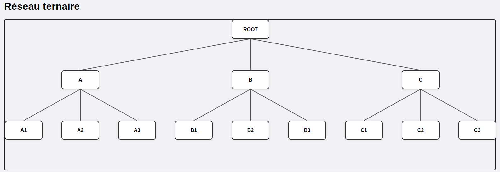

# MLM Tree View

📈 **MLM Tree View** est une bibliothèque PHP légère et extensible permettant de générer des **arbres hiérarchiques** de type **marketing de réseau (MLM)** avec un rendu **HTML stylisé prêt à l'emploi**.

---

## 🚀 Fonctionnalités

- ✅ Génération automatique d'arborescences MLM à partir de structures de données PHP
- 🎨 Rendu HTML propre et facilement intégrable dans une page web
- 💅 Style CSS inclus
- ⚙️ Aucune dépendance externe (autonome)
- 🧩 Prise en charge des structures récursives (niveaux illimités)

---

## 📦 Installation

Utilisez Composer pour installer le package :

```bash
composer require modernik/mlm-tree-view
```

---

## 🛠 Utilisation de base

### Exemple minimal

```php

use Modernik\MlmTreeView\GenericTreeNode;
use Modernik\MlmTreeView\Placement\CenteredTreeLayoutEngine;
use Modernik\MlmTreeView\Renderer\BasicHtmlTreeRenderer;

$ternary = new GenericTreeNode(1, 'ROOT', [
    new GenericTreeNode(2, 'A', [
        new GenericTreeNode(3, 'A1'),
        new GenericTreeNode(4, 'A2'),
        new GenericTreeNode(5, 'A3'),
    ]),
    new GenericTreeNode(6, 'B', [
        new GenericTreeNode(7, 'B1'),
        new GenericTreeNode(8, 'B2'),
        new GenericTreeNode(9, 'B3'),
    ]),
    new GenericTreeNode(10, 'C', [
        new GenericTreeNode(11, 'C1'),
        new GenericTreeNode(12, 'C2'),
        new GenericTreeNode(13, 'C3'),
    ])
]);

// Création du renderer
$layout = new CenteredTreeLayoutEngine();
$renderer = new BasicHtmlTreeRenderer($layout, true);

```

### Rendu HTML dans un navigateur


### Avec style embarqué

```php
<h1>Réseau binaire</h1>
<?= $renderer->render($ternary) ?>
```

> 💡 Le paramètre `withStyles: true` injecte le CSS directement dans la page. Pratique pour un rendu rapide sans configuration.

---

## 🎨 Personnalisation du style

Le style est écrit en **CSS** (fichier `mlm-tree.css`).

Vous pouvez :
- Inclure manuellement le CSS dans votre layout
- Modifier le CSS pour adapter l’apparence de l’arbre à votre charte graphique

```html
<link rel="stylesheet" href="/chemin/vers/mlm-tree.css">
```

---

## 🧱 Structure des données attendue

> (À ajouter bientôt) 

---

## 🧪 Tests

> (À ajouter bientôt)

---

## 📄 Licence

Ce projet est sous licence **MIT** — vous pouvez l’utiliser librement dans vos projets personnels ou commerciaux.

---

Pour toute suggestion, amélioration ou bug, n’hésitez pas à créer une *issue* ou un *pull request*.

---
