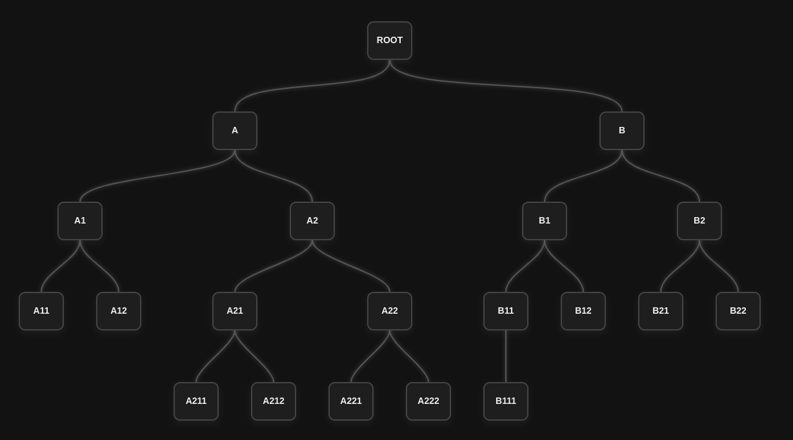
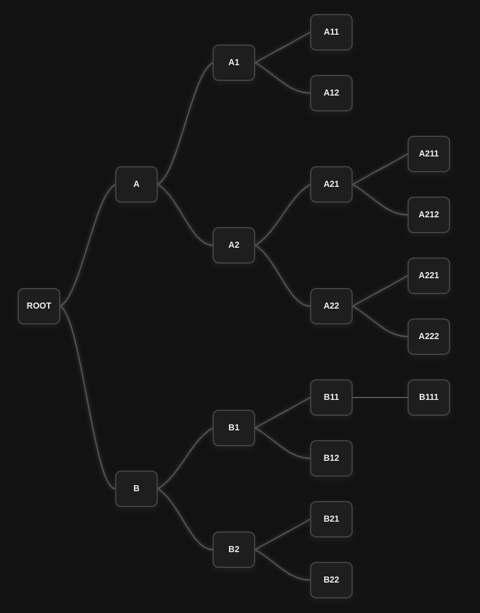

# MLM Tree View

**MLM Tree View** est une bibliothèque PHP légère et extensible permettant de générer des **arbres hiérarchiques** de type **marketing de réseau (MLM)** avec un rendu **HTML stylisé prêt à l'emploi**.

---

## Fonctionnalités

- Génération automatique d'arborescences MLM à partir de structures de données PHP
- Rendu HTML propre et facilement intégrable dans une page web
- Style CSS inclus
- Aucune dépendance externe (autonome)
- Prise en charge des structures récursives (niveaux illimités)

---

## 📦 Installation

Utilisez Composer pour installer le package :

```bash
composer require modernik/mlm-tree-view
```

---

## Utilisation de base

### Exemple minimal

```php

use Modernik\MlmTreeView\GenericTreeNode;
use Modernik\MlmTreeView\Placement\CenteredTreeLayoutEngine;
use Modernik\MlmTreeView\Renderer\BasicHtmlTreeRenderer;

$ternary = new GenericTreeNode(1, 'ROOT', [
    new GenericTreeNode(2, 'A', [
        new GenericTreeNode(3, 'A1'),
        new GenericTreeNode(4, 'A2'),
        new GenericTreeNode(5, 'A3'),
    ]),
    new GenericTreeNode(6, 'B', [
        new GenericTreeNode(7, 'B1'),
        new GenericTreeNode(8, 'B2'),
        new GenericTreeNode(9, 'B3'),
    ]),
    new GenericTreeNode(10, 'C', [
        new GenericTreeNode(11, 'C1'),
        new GenericTreeNode(12, 'C2'),
        new GenericTreeNode(13, 'C3'),
    ])
]);

// Création du renderer
$layout = new CenteredTreeLayoutEngine();
$renderer = new BasicHtmlTreeRenderer($layout, true);

```

> 💡 Le paramètre `withStyles: true` injecte le CSS directement dans la page. Pratique pour un rendu rapide sans configuration.

### Démo 
Tu peux exécuter la démo dans le dossier web/ :

```bash
php -S localhost:8989 -t ./web/
```
Et ouvrir http://localhost:8989 ou http://localhost:8989/linked.php dans ton navigateur.

### Rendu HTML dans un navigateur
```php
<h1>Réseau binaire</h1>
<?= $renderer->render($ternary) ?>
```


---
#### Autres example, un arbre binaire



---

## Personnalisation du style

Le style est écrit en **CSS** (fichier `mlm-tree.css`).

Vous pouvez :
- Inclure manuellement le CSS dans votre layout
- Modifier le CSS pour adapter l’apparence de l’arbre à votre charte graphique

En interne mlm-tree-view est entièrement basé sur les classes css suivantes:
```css
.mlm-tree-view-container {
/*  personnalisation du conteneur principale  */
}

.mlm-tree-node {
/*  Personnalisation du conteneur d'un noeud  */
}

.mlm-tree-node-content {
/*  Personnalisation du conteneur des contenus d'un noeud  */
}

.mlm-tree-view-container path {
/*  Personnalisation des paths qui lie les noeuds de l'arbre  */
}

/* Animation */
@keyframes fadeInUp {
    /* Animation des noeuds de l'arbre */
    0% {
        opacity: 0;
        transform: translateY(20px);
    }
    100% {
        opacity: 1;
        transform: translateY(0);
    }
}

@keyframes drawPath {
    /* Animation paths qui lie les noeuds de l'arbre */
    to {
        stroke-dashoffset: 0;
    }
}
```
---

## Moteurs de mise en page (Layout Engines)

La disposition des nœuds dans l’arborescence est gérée par des **moteurs de mise en page**. Ces composants sont responsables du calcul des coordonnées de chaque nœud en fonction de leur position hiérarchique, permettant ainsi un rendu visuellement cohérent et lisible.

### `CenteredTreeLayoutEngine` (inclus)

Le moteur `CenteredTreeLayoutEngine` est fourni par défaut. Il organise les enfants de chaque nœud de manière centrée, ce qui convient particulièrement aux arbres symétriques et équilibrés.

Ce moteur prend en charge deux orientations :
- **`horizontal`** : les enfants s’étendent horizontalement à partir de leur parent.
- **`vertical`** : les enfants s’étendent verticalement, en dessous de leur parent.

Voici le constructeur des ce layout:
```php
 public function __construct(
        private int $nodeWidth = 120,
        private int $nodeHeight = 60,
        private int $spaceX = 60,
        private int $spaceY = 100,
        private string $orientation = self::ORIENTATION_HORIZONTAL
    ) {
    }
```

### Création de moteurs personnalisés

La bibliothèque a été conçue pour être extensible. Vous pouvez créer vos propres moteurs de mise en page en implémentant l’interface suivante :
*`Modernik\MlmTreeView\Placement\TreeLayoutEngine`*, qui contient 3 méthodes :

```php
class MyCustomTreeLayoutEngine implements TreeLayoutEngine
{

    /**
     * @inheritDoc
     */
    public function layout(TreeNode $root): PositionedTreeNode 
    {
        //Calcule et retourne un arbre positionné à partir d'un arbre logique.
    }


    /**
     * @inheritDoc
     */
    public function getBound() : Bound 
    {
        // calcul de la taille de l'espace de travail
    }

    /**
     * @inheritDoc
     */
    public function getOrientation() : string
    {
        //Renvoie la configuration de l'orientation du layout
    }
}

```

Cela vous permet de définir une stratégie d’agencement totalement personnalisée selon vos besoins spécifiques (ex. : arbre inversé, arborescence radial, positionnement géométrique complexe, etc.).

Un moteur personnalisé devra fournir une méthode capable de transformer une structure de nœuds en une collection de points positionnés, prêts à être utilisés par un renderer.

### Perspectives d’évolution

Dans le but d’améliorer la flexibilité et la richesse des visualisations possibles, deux nouveaux moteurs de mise en page sont prévus dans les futures versions de la bibliothèque :

#### `CompactCenteredTreeLayoutEngine` *(à venir)*

Ce moteur reprend les principes de disposition du `CenteredTreeLayoutEngine` mais avec une **optimisation avancée de l’espace**. L’objectif est de réduire la distance entre les nœuds tout en maintenant une lisibilité claire de la hiérarchie.  
Il sera particulièrement utile pour représenter des arbres larges et profonds dans un espace restreint, comme dans des interfaces embarquées ou des rapports imprimables.

#### `RadialTreeLayoutEngine` *(à venir)*

Ce moteur introduira une **disposition radiale**, dans laquelle les nœuds s'organisent en cercles concentriques autour d’un point central. Chaque niveau hiérarchique est représenté par un anneau, créant un rendu dit “*sunburst*” ou “*sunflower*”.

Ce type de représentation est particulièrement adapté à :

- la visualisation de **structures généalogiques** ;
- l’analyse **hiérarchique descendante** dans des interfaces orientées data visualisation ;
- les cas où l’**équilibre esthétique** est aussi important que la lisibilité fonctionnelle.

Ces moteurs respecteront le contrat défini par l’interface `TreeLayoutEngine`, garantissant une intégration fluide avec les renderers existants et futurs.

---

## Moteurs de rendu (Renderers)

Une fois la structure de l’arbre générée et positionnée via un moteur de mise en page, elle peut être convertie en contenu visuel à l’aide d’un **moteur de rendu**.

Les moteurs de rendu transforment les données spatiales de l’arbre en une sortie HTML stylisée, prête à être affichée dans un navigateur.

### Renderers disponibles

#### `BasicHtmlTreeRenderer`

Ce moteur génère une structure HTML simple basée sur des `<div>`, avec une mise en forme CSS légère. Il convient parfaitement pour des cas d’utilisation minimalistes ou des intégrations personnalisées.
```php
public function __construct(TreeLayoutEngine $layoutEngine, bool $withStyle = true)
{
}
```
#### `LinkedHtmlTreeRenderer`

Ce renderer génère un arbre HTML dans lequel chaque nœud est encapsulé dans un lien (`<a>`), permettant l’ajout de comportements interactifs tels que la navigation ou les actions dynamiques (ex. redirection, édition, etc.).

Prototype du constructeur :

```php
public function __construct( TreeLayoutEngine $layoutEngine, LinkGenerator $linkGenerator, bool $withStyle = true )
{
}
```

---

### Comparatif des moteurs de rendu existants

| Renderer                 | Interactivité | Liens intégrés | Personnalisable via CSS | Complexité visuelle | Idéal pour...                            |
|--------------------------|---------------|----------------|-------------------------|---------------------|------------------------------------------|
| `BasicHtmlTreeRenderer`  | ❌             | ❌              | ✅                       | ⭐☆☆☆☆               | Démonstration simple, prototypes, test.  |
| `LinkedHtmlTreeRenderer` | ✅             | ✅              | ✅                       | ⭐⭐☆☆☆               | Intégration web, navigation entre nœuds. |

---

### À venir

La bibliothèque a vocation à s’enrichir de nouveaux moteurs de rendu, notamment :

- **Rendu SVG** : pour un rendu vectoriel dynamique et fluide.
- **Export PNG / JPEG** : pour la génération d’images statiques d’arbres.
---

## Tests

> (À ajouter bientôt)

---

## 📄 Licence

Ce projet est sous licence **MIT** — vous pouvez l’utiliser librement dans vos projets personnels ou commerciaux.

---

Pour toute suggestion, amélioration ou bug, n’hésitez pas à créer une *issue* ou un *pull request*.

---
